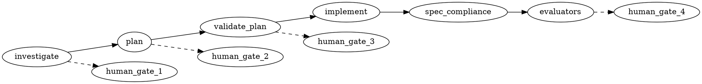
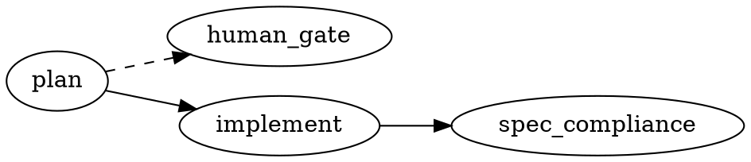
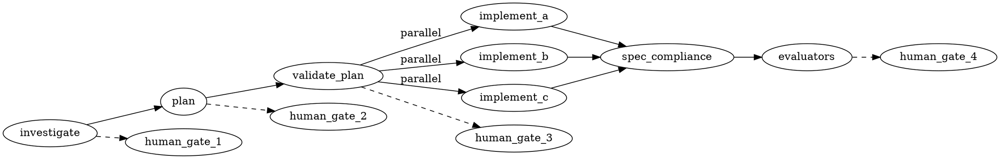
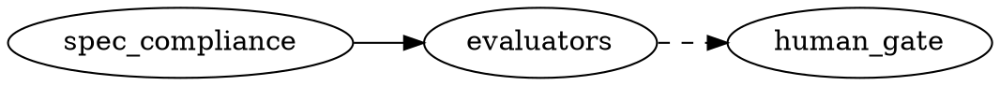

# Agent Team Pipeline — Orchestrator Skill

## Overview

Structured 6-phase pipeline for multi-agent development work. Each phase has a dedicated agent type, clear deliverables, gate checks, and **human checkpoints** that block forward progress.



**Core principles:**
- **Right-size the pipeline** — assess intensity (light/standard/heavy/review) before starting
- Each phase is independently gated
- Human approves investigation, plan, and implementation before proceeding
- Spec compliance before code quality (OBRA pattern)
- Evaluators are pluggable via project config
- Language-agnostic — works for any language/framework

## When This Skill Is Invoked

Start by understanding what the user needs, then set up the pipeline:

1. **Ask what they want to accomplish** — "What change are you looking to make?" Get the goal, not just the task. If they've already described it, confirm your understanding.
2. **Detect the environment** — infer language, build/test commands, and base branch from the project's CLAUDE.md, Cargo.toml/package.json/etc., or ask if unclear.
3. **Check for evaluator config** — look for `.claude/pipeline-evaluators/`. If it exists, note the language and any custom evaluators. If not, mention that built-in evaluators will run without language-specific hints.
4. **Discover best-practice skills** — dispatch a haiku agent with the project's language, domain, and goal. The agent scans the available skills list and returns a shortlist of skill names relevant to this pipeline. Do NOT read skill content yourself — the planner and evaluators will each load relevant skills in their own context. Report the shortlist: "These skills look relevant to this pipeline: [list]. The planner and evaluators will use them."
5. **Assess intensity** — based on the goal, propose light/standard/heavy/review (see Pipeline Intensity below). Explain what that means for this specific task.
6. **Present your plan** — summarize: "Here's what I'm proposing: a [intensity] pipeline for [goal]. That means [phases that will run]. Best-practice skills: [list]. Sound good?"
7. **Wait for confirmation** — the user may add/remove skills from the list, override intensity, skip phases, or refine the goal.

Only after the user confirms do you proceed to the Orchestrator Protocol below.

## Quick Reference — What to Load

| If you're... | Load |
|---|---|
| Setting up a new pipeline | This skill (you're reading it) |
| Configuring evaluators for a project | `references/evaluator-config.md` |
| Planning parallel implementation streams | `references/parallel-pipelines.md` |
| Learning from past pipeline failures | `references/lessons.md` |

## Your Role: Orchestrator as Synthesizer

After each agent completes, synthesize — don't relay raw output:
1. Read the full output — understand what was found, decided, or built
2. Identify the key findings, risks, and decisions
3. Form your own judgment about whether the gate passes
4. Present a concise summary to the user with your recommendation
5. Wait for the user's decision before proceeding

## Pipeline Anatomy

### Phase 1: Investigate
- **Agents**: Choose based on what the investigation needs:
  - `agent-team-pipeline:codebase-investigator` — local codebase patterns and construction sites
  - `agent-team-pipeline:internet-researcher` — external docs, API references, library behavior
  - `agent-team-pipeline:combined-researcher` — both local codebase + external docs in one dispatch
  - `agent-team-pipeline:remote-code-researcher` — clone and read external library source code
- **Input**: Search goal + constraints
- **Output**: Structured findings catalog with file:line citations and/or sourced external findings
- **Gate**: Findings are complete (not just "enough" examples)
- **Human checkpoint**: Present synthesized findings to user. User confirms completeness or directs additional investigation.

### Phase 2: Plan
- **Agent**: `agent-team-pipeline:planner` (opus)
- **Input**: Investigation findings (user-confirmed)
- **Output**: Actionable change plan with exact file:line specifications + task dependency graph
- **Gate**: Every change is specific enough for an implementor with zero codebase context
- **Human checkpoint**: Present plan summary with task graph. User approves, modifies, or rejects before validation.

### Phase 3: Validate Plan
- **Agent**: `agent-team-pipeline:plan-validator` (opus)
- **Input**: Change plan + access to codebase
- **Output**: Verification verdict (PASS / FAIL)
- **Gate**: All factual claims independently verified against source code
- **Human checkpoint**: Present validation results. User confirms implementation should proceed.

### Phase 4: Implement
- **Agent**: `agent-team-pipeline:implementor` (haiku, worktree-isolated)
- **Input**: Validated plan (single task or task group)
- **Output**: Committed changes + verification evidence
- **Gate**: Build passes, tests pass, commit created

### Phase 5: Spec Compliance
- **Agent**: `agent-team-pipeline:spec-reviewer` (sonnet)
- **Input**: Plan + diff (BASE_SHA...HEAD_SHA)
- **Output**: Spec compliance verdict (PASS / FAIL)
- **Gate**: All planned changes verified in code, no missing items
- **Transition from Phase 4**: Verify commit(s) landed (check worktree branch or main). Record `BASE_SHA` (commit before implementation) and `HEAD_SHA` (current commit), then dispatch spec-reviewer with the plan and SHA range.

### Phase 6: Evaluators
- **Agent**: `agent-team-pipeline:evaluator` (configurable model)
- **Input**: Diff + evaluator-specific prompt
- **Output**: Structured findings with severity classification
- **Gate**: Per-evaluator (zero-issues or advisory)
- **Config**: `.claude/pipeline-evaluators/` (see `references/evaluator-config.md`)
- **Human checkpoint**: Present consolidated evaluator results. User decides on any disputed findings before fixes.
- **Transition from Phase 5**: If spec compliance FAILS — dispatch fixer (in worktree), then re-run spec compliance. If PASSES — dispatch all evaluators in parallel (they're independent). Wait for all to complete, synthesize into a consolidated report. If any `zero-issues` evaluator returns findings — dispatch fixer (in worktree), re-run that evaluator.

## Orchestrator Protocol

### Starting a Pipeline

1. **Define the goal** — what needs to change and why
2. **Set parameters**:
   - `PIPELINE_NAME`: short identifier (e.g., `error-patterns`, `email-migration`)
   - `LANGUAGE`: target language (rust, typescript, python, go, etc.)
   - `CHECK_COMMAND`: build/lint command (e.g., `cargo clippy --all`, `npm run lint`)
   - `TEST_COMMAND`: test command (e.g., `cargo nextest run`, `jest`, `pytest`)
   - `BASE_BRANCH`: branch to merge into (default: main)
3. **Assess intensity** — select a pipeline profile (see below)
4. **Check for evaluator config** — read `.claude/pipeline-evaluators/` if it exists. If no config exists or it lacks a `language` field, warn the user: built-in evaluators will run without language-specific hints and may produce generic findings. Suggest configuring a language for better coverage.
5. **Present to user** — "This looks like a [light/standard/heavy] pipeline. Here's what that means for this task." User confirms or overrides.
6. **Dispatch first phase** per the selected profile

### Pipeline Intensity

Not every change needs the full 6-phase pipeline. The orchestrator assesses the task's scope, risk, and complexity to select a profile. **Present your assessment to the user — they have final say.**

#### Assessing Intensity

Consider these factors:

| Factor | Light | Standard | Heavy |
|--------|-------|----------|-------|
| Files affected | 1–3 | 4–10 | 10+ |
| Scope clarity | Well-understood, obvious fix | Moderate judgment needed | Cross-cutting, exploratory |
| Risk | Low (isolated change) | Medium (touches interfaces) | High (public APIs, data, security) |
| Construction sites | Few, known upfront | Multiple, need discovery | Many, need exhaustive search |

#### Light Pipeline

For small, well-understood changes where the orchestrator already grasps the scope.



**What changes:**
- **Skip Phase 1** (investigate) — orchestrator writes the plan context directly
- **Skip Phase 3** (validate plan) — plan is simple enough for the user to verify
- **Skip Phase 6** (evaluators) — or run advisory-only if configured
- **One human gate** — plan approval before implementation
- **Planner model** — downgrade to sonnet (simpler plans need less judgment)

**Examples:** single-file bug fix, adding a log line, updating a config value, renaming a symbol across 2 files.

#### Standard Pipeline

The default. Full 6-phase pipeline for tasks requiring investigation and judgment.


**What changes:** Nothing — this is the full pipeline as documented above.

**Examples:** adding a feature, refactoring a module, updating error handling patterns, migrating an API.

#### Heavy Pipeline

For large cross-cutting changes that need exhaustive investigation and parallel execution.



**What changes:**
- **Exhaustive investigation** — multiple research agents (codebase, internet, remote-code) with different strategies, results merged
- **Task dependency graph** — planner outputs parallel-safe task groups (see `references/parallel-pipelines.md`)
- **Parallel implementation** — independent tasks dispatched simultaneously in separate worktrees
- **All evaluators** — built-in + custom, all at `zero-issues` gate
- **Human gates at every transition** — including after spec compliance

**Scaling note:** For plans with 15+ changes, the orchestrator may chunk validation and spec review — dispatch one validator/reviewer per task group rather than a single agent for the entire plan. This keeps each agent's context focused and prevents quality degradation at the tail of long reviews.

**Examples:** cross-cutting refactor (error patterns across 5 crates), security audit remediation, architecture migration, multi-worker feature rollout.

#### Review Pipeline

For reviewing existing changes (a PR, a branch diff, a worktree) without running the full development pipeline. Enters directly at spec-compliance + evaluators.



**What changes:**
- **Skip Phases 1–4** — the code already exists; no investigation, planning, or implementation
- **Input**: SHA range (`BASE_SHA...HEAD_SHA`), PR number, or branch name. The orchestrator resolves to a diff.
- **Plan substitute**: PR description, commit messages, or a user-supplied review spec serves as the "plan" for the spec-reviewer
- **One human gate** — after evaluators, before any fix dispatch
- **Mode**: `advisory` (report only, no fixer dispatch) or `blocking` (dispatches fixer on zero-issues failures, re-runs that evaluator)

**Examples:** PR review, post-merge audit, reviewing a teammate's worktree branch.

#### Intensity Override

The user can always override:
- "Run this as heavy" — even if you assessed it as light
- "Skip evaluators" — even if the profile calls for them
- "I'll review the plan myself, skip validation" — human takes over a phase

Respect the override. Log the deviation for the pipeline record.

### Reassessing Intensity Mid-Pipeline

Investigation sometimes reveals more scope than the initial assessment suggested. If so:

1. **Stop before dispatching the planner** — do not proceed on a stale intensity assessment
2. **Preserve completed work** — investigation findings are still valid; nothing is wasted
3. **Re-plan from findings** — use the investigation output to reassess intensity (e.g., light → standard, standard → heavy)
4. **Present to user**: "Investigation revealed [N more files / cross-cutting impact / interface changes] than expected. I'm upgrading this from [old] to [new] intensity. Here's what that adds: [list of phases or steps added]. Confirm before I continue?"
5. Wait for user confirmation, then proceed with the upgraded profile.

Do not silently upgrade intensity — always surface the change and get user buy-in.

### Human Gate Protocol

At each human checkpoint:

1. **Synthesize** — don't dump raw output. Distill the key findings, decisions, and risks.
2. **Recommend** — state your recommendation (proceed / re-investigate / modify plan / etc.)
3. **Surface concerns** — flag anything that looked off, even if the gate technically passed
4. **Wait** — do not proceed until the user explicitly approves

**What "synthesize" means:**
- Investigation: "Found N sites across M files. Key categories: ... Notable edge case: ... Confidence: high/medium."
- Plan: "N changes in M phases. Dependencies: A→B→C. Riskiest change: ... Estimated scope: small/medium/large."
- Validation: "Validator approved with N notes. Verified N/M claims. Key verification: ..."
- Evaluators: "3 evaluators ran. Code-quality: PASS. Type-safety: 1 minor finding. Security: PASS."

### Task Dependency Graph

The planner outputs a **task dependency graph**, not a flat list. Tasks may have:
- **Dependencies** — task B requires task A to complete first
- **Parallelism** — independent tasks can run simultaneously in separate worktrees
- **Grouping** — related changes that must be committed together

The orchestrator:
1. Reviews the graph for correctness (no cycles, dependencies make sense)
2. Presents the graph to the user during the Phase 2 human gate
3. Dispatches independent tasks in parallel where possible
4. Manages worktree lifecycle (each mutating agent gets its own worktree)
5. Coordinates merge order based on dependency edges

### Workspace Isolation Rules

**Any agent that mutates files MUST run in a worktree.** This includes:
- Implementors (Phase 4)
- Fixers (dispatched on spec-compliance or evaluator failure)

These agents declare `isolation: worktree` in their frontmatter.

**Read-only agents run in the main worktree.** This includes:
- Investigators (Phase 1)
- Planners (Phase 2)
- Plan validators (Phase 3)
- Spec reviewers (Phase 5)
- Evaluators (Phase 6)

### Dispatch Examples

**Read-only agent (no isolation):**
```
Task tool — subagent_type: "agent-team-pipeline:codebase-investigator"
  prompt: "<investigation goal and constraints>"
  isolation: none (omit the field)
```

**Mutating agent:**
```
Task tool — subagent_type: "agent-team-pipeline:implementor"
  prompt: "<validated plan for this task>"
```

**Parallel evaluator dispatch (all simultaneously):**
```
Task tool × N — subagent_type: "agent-team-pipeline:evaluator"
  prompt: "<evaluator prompt + diff>"
  isolation: none
  (dispatch all in the same tool call batch)
```

**Fixer dispatch (after spec-compliance or evaluator failure):**
```
Task tool — subagent_type: "agent-team-pipeline:fixer"
  prompt: "<findings to fix with file:line references + verification commands>"
```

### Between Phases

After each agent completes:
1. **Read the full output** — understand what was found, not just the verdict
2. **Check the gate** — does the output meet the phase's quality bar?
3. **If gate fails** — synthesize the failure, send feedback, re-dispatch (same phase)
4. **If gate passes** — synthesize findings and present to user at human checkpoint
5. **Wait for user approval** — proceed only after explicit go-ahead

### If an Agent Goes Idle Without Reporting

Check the git state directly (`git log --oneline -3`). Worktree auto-cleanup means the Task tool succeeded — silence does not mean failure.

### After All Evaluators Pass

1. Present final consolidated results to user
2. Merge worktree changes to target branch (with user approval)
3. If the `ed3d-extending-claude` plugin is installed, optionally dispatch `project-claude-librarian` to update project documentation

## Pluggable Evaluators

Evaluators are the pipeline's extensibility point. See `references/evaluator-config.md` for full schema.

**Built-in evaluators** (run by default):
- `code-quality` — architecture, naming, test coverage
- `type-safety` — language-specific type system concerns
- `security` — OWASP top 10 patterns

**Custom evaluators** (project-configured):
- Each custom evaluator is a `.md` file in `.claude/pipeline-evaluators/` with frontmatter and prompt body
- Each has: description, model, gate mode, prompt, optional language hints
- Examples: PII privacy, framework patterns, domain invariants

**Gate modes:**
- `zero-issues` — any finding blocks the pipeline (must fix and re-run)
- `advisory` — findings reported to user but don't block

## STOP — Common Mistakes

| You're about to... | Why it's wrong | Do this instead |
|---|---|---|
| Skip the investigation | Plans without investigation miss construction sites | Always investigate first |
| Trust the planner's factual claims | Planners make wrong assumptions | Dispatch plan-validator to independently verify |
| Skip spec compliance | You'll review quality on incomplete implementations | Always run spec compliance first |
| Proceed without user approval at a human gate | Users catch what automation misses | Wait for explicit go-ahead |
| Assume agent silence means failure | Implementor may have committed silently | Check `git log --oneline -3` |
| Run evaluators sequentially | They're independent | Dispatch all evaluators simultaneously |
| Mark "advisory" findings as blocking | Advisory evaluators report but don't block | Only `zero-issues` gate blocks |
| Do the work yourself | You're the orchestrator | Dispatch agents for all work |
| Dispatch a mutating agent without worktree isolation | Direct mutation risks the working tree | Implementor and fixer agents must always run isolated |
| Relay raw agent output to user | Users need synthesis, not data dumps | Distill findings into concise summaries |
| Skip the dependency graph | Flat task lists miss ordering constraints | Planner must output task dependencies |
| Run full pipeline on a trivial change | Wastes tokens — 6 phases for a typo fix | Assess intensity first; use light pipeline |
| Skip intensity assessment | Over-engineering or under-engineering the pipeline | Always assess and present to user before starting |

## Model Selection

| Role | Model | Rationale |
|---|---|---|
| Research agents | haiku | Mechanical search — codebase, internet, combined, remote-code |
| Planner | opus (standard/heavy), sonnet (light) | Judgment scales with plan complexity |
| Plan validator | opus | Must reason about cascading effects and verify assumptions |
| Implementor | haiku | Follows explicit plan — mechanical execution |
| Spec reviewer | sonnet | Reads code and compares to spec — moderate judgment |
| Evaluator | configurable | Depends on evaluator complexity |
| Orchestrator | any | Session model — dispatch cost is low |
